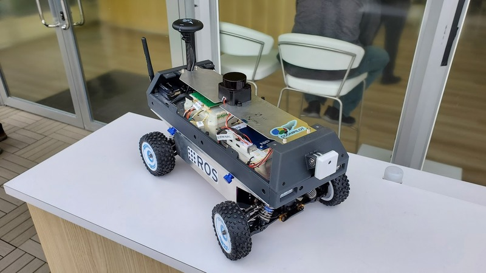

En Février 2024 l'équipe RoverCS composé de Bilal Azzi, Bouhamed Mohamed et Le Van Enzo, a reçu un kit de NXP afin de monter un rover, nommé MR-B3RB.

Il est constitué d'une base motorisée comme le montre cette image 

En retirant la plaque métalique du dessus on a accès à l'intérieur du rover 

Ici est représenté le composant de distribution de la puissance : c'est lui qui va alimenté correctement les composants du rover ainsi que le moteur. La batterie d'alimentation va justement être également placée à cet étage, collée avec des scratchs juste à côté de la carte d'alimentation en puissance.

Autour de cette partie on monte également l'armature en plastique (imprimé en 3D par NXP) avec des LEDS  

On monte également alors deux nouvelles cartes : le NavQ+ et le MRCANHUB. La première s'occupe de la comunication entre un ordinateur, et les éléments externes (GPS, Lidar) avec le MRCANHUB qui s'occupe lui de commander le robot (moteurs).  

Finalement en rajoutant la caméra avant, le GPS et le Lidar notre rover ressemble à : 

Une fois le robot monté, on peut accéder aux câbles de la batterie via un des côtés du rover. Il est également possible de se connecter aux différentes cartes :

- On peut se connecter à la NavQ+ pour contrôler le robot via une interface de contrôle par câble ou par Wifi.
- On peut se connecter au MRCANHUB par câble afin d'upload le code du robot (ROS2 en C) depuis un ordinateur.