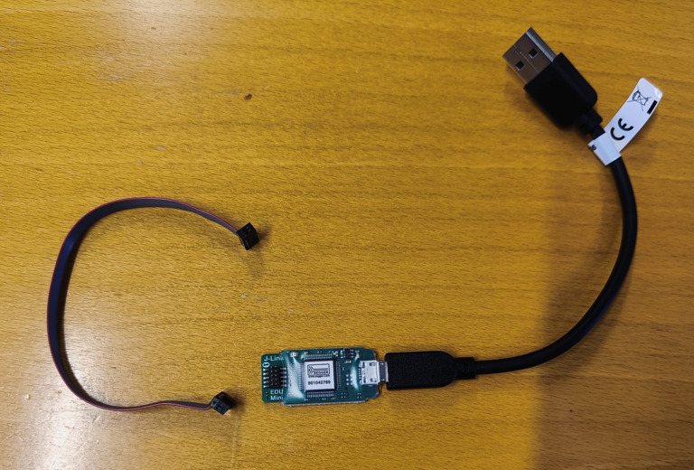
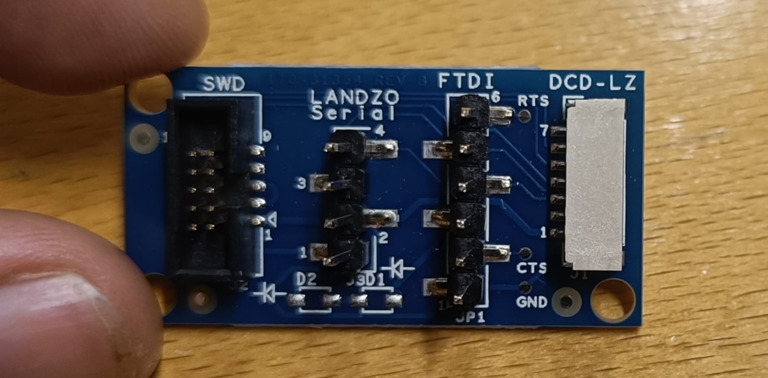
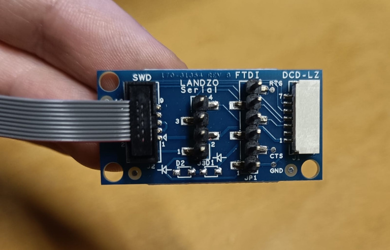
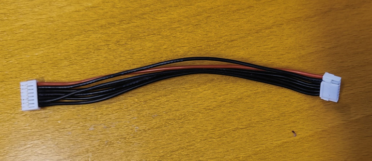
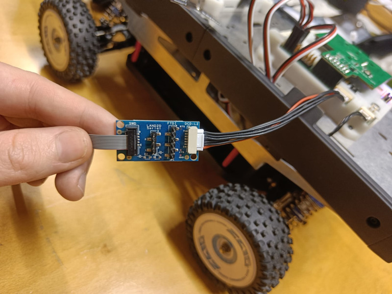
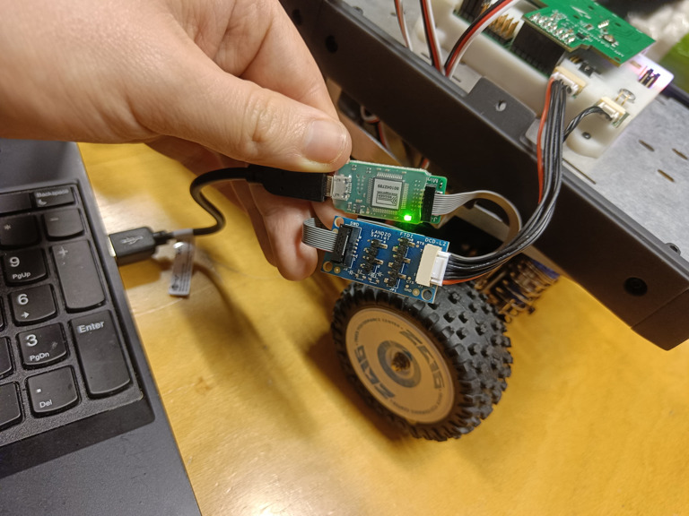

Comme ce qu'il est expliqué un peu dans la partie Hardware, pour développer le robot il faudra se connecter aux différentes cartes. Voici ce qu'il est possible de faire niveau software (les procédures d'installation viennent après) :

- Utiliser un simulateur du robot avec du code pour faire une pré vérification dans un environnement de test du fonctionnement des fonctionnalités développées
- Connecter le Rover (grâce à la NavQ+) à une interface de contrôle afin de le piloter depuis un ordinateur (possibilité de rajouter un joystick)
- Upload notre code ROS2 sur le robot (via MRCANHUB) afin de le faire fonctionner

# Installation clean d'un environnement

Il est actuellement *nécessaire* de posséder un ordinateur (de préférence portable) qui fonctionne avec Linux (de préférence un environnement simple comme Ubuntu) sous l'architecture x64 (donc pas de Macbook M1/M2/M3 désolé).
Il est également nécessaire de posséder un compte GitHub ! Et il faudra établir des autorisations SSH (mais pas de panique ça sera expliqué après).

## Docker

Comme tous les hardware sont différents et qu'on n'est pas à l'abris qu'un utilisateur ai déjà installé des trucs bizarre sur son ordinateur, pour ne pas compromettre l'intégrité de ses installations la compétition propose une image Docker pour la compétition.
C'est ce que nous allons utilisé car c'est toujours bien plus simple d'utilisé Docker. Voici un guide d'installation de Docker d'après leur site internet :

Copié collé les différents code dans un terminal (veillez à bien éxécuter le code entre chaque étape)

- Désinstallation de tous les packages qui existent en rapport avec une précédente installation de Docker :

```
for pkg in docker.io docker-doc docker-compose docker-compose-v2 podman-docker containerd runc; do sudo apt-get remove $pkg; done
```

- Récupérations des clées d'installation des différents packages :

```
# Add Docker's official GPG key:
sudo apt-get update
sudo apt-get install ca-certificates curl
sudo install -m 0755 -d /etc/apt/keyrings
sudo curl -fsSL https://download.docker.com/linux/ubuntu/gpg -o /etc/apt/keyrings/docker.asc
sudo chmod a+r /etc/apt/keyrings/docker.asc

# Add the repository to Apt sources:
echo \
  "deb [arch=$(dpkg --print-architecture) signed-by=/etc/apt/keyrings/docker.asc] https://download.docker.com/linux/ubuntu \
  $(. /etc/os-release && echo "$VERSION_CODENAME") stable" | \
  sudo tee /etc/apt/sources.list.d/docker.list > /dev/null
sudo apt-get update
```

- Installation des packages Docker :

```
sudo apt-get install docker-ce docker-ce-cli containerd.io docker-buildx-plugin docker-compose-plugin
```

- Vérification de l'installation : (vous devriez avoir un message de plusieurs lignes dont une contenant "Hello World")

```
sudo docker run hello-world
```

- Permissions d'utiliser docker pour un utilisateur :

```
sudo groupadd docker
sudo usermod -aG docker $USER
newgrp docker
```

- Lancement de docker au démarrage :

```
sudo systemctl enable docker.service
sudo systemctl enable containerd.service
```

- Dernière vérification :

```
docker run hello-world
```

Voilà Docker est bien installé et vous êtes prêt à installé les softs.

## Image docker

Comme je l'ai précisé il existe une image du soft qui permet de tout faire simplement. Le code suivant permet de créer un répertoire, de cloner un repository qui contient l'image, et d'installer l'image. *Attention* l'installation de l'image peut prendre une dizaine de minute. Veillez à accepter tout ce qui peut vous être demandé lors de l'installation et à ne pas laisser votre ordinateur se mettre en veille

```
mkdir -p ~/cognipilot
cd ~/cognipilot
git clone -b airy https://github.com/cognipilot/docker
cd  ~/cognipilot/docker
git submodule update --init --recursive
cd ~/cognipilot/docker/dream
./dream start
```

Maintenant que l'image docker est installée vous êtes prêt à développer. Pour tout ce qui va maintenant se passer il faudra pénétrer notre image docker, qui âgit comme un nouvel espace de travail, propre et conçu pour la compétition. Rien de ce que vous y ferez ne sera visible sur votre espace personnel d'origine et c'est ça qui est beau.

Pour pénétrer l'image docker utilisez toujours cette commande :

```
cd ~/cognipilot/docker/dream
./dream start
./dream exec
```

Pour quitter cet espace appuyez sur "CTRL+D" dans la console

## Autorisations de GitHub via SSH

Afin de faciliter la connexion avec github, on peut établir des autorisations via SSH. Pour ça il faut pénétrer l'image docker :

```
cd ~/cognipilot/docker/dream
./dream start
./dream exec
```


Ensuite il faut générer une clé SSH que l'on passera à GitHub  :

```
ssh-keygen -t ed25519 -C "votre_adresse_mail_github@example.com"
```

Cliquez ensuite toujours simplement sur votre touche "Entrée" jusqu'à ce que le logiciel ne vous demande plus rien. La clé sera alors créée, pour la récupérer faites :

```
cat ~/.ssh/id_ed25519.pub
```

Faites un copié collé du résultat en entier (sur certains terminaux dont celui de base pour Ubuntu il faut faire click droit copié, ou CTRL+MAJ+C après sélection)

- Ensuite dans GitHub, dans le coin supérieur droit de n'importe quelle page, cliquez sur votre photo de profil, puis sur Paramètres.

- Dans la section "Accès" de la barre latérale, cliquez sur Clés SSH et GPG.

- Cliquez sur Nouvelle clé SSH ou Ajouter une clé SSH.

- Dans le champ "Titre", ajoutez une étiquette descriptive pour la nouvelle clé. Par exemple, si vous utilisez un ordinateur portable personnel, vous pouvez appeler cette clé "Ordinateur portable personnel".

- Sélectionnez le type de clé authentification

- Dans le champ "Clé", collez votre clé publique.

- Cliquez sur Ajouter une clé SSH.

Si vous y êtes invité, confirmez l'accès à votre compte sur GitHub.

Maintenant vous avez le droit d'utiliser votre compte Github depuis votre ordinateur, sans authentification supplémentaire. ceci vous permet donc de pouvoir participer au développement du logiciel de ce rover !! Mais vous n'y êtes pas obligé, déjà c'est bien si on arrive à faire quelque chose de bien pour la NXPCup

## Compilation des différents softs

Normalement vous êtes toujours dans votre image docker mais si ce n'est pas le cas :

```
cd ~/cognipilot/docker/dream
./dream start
./dream exec
```

On dispose dans cette image d'un script pré conçue qui compile tous les logiciels dont on a besoin pour contrôler le robot, faire la simulation et upload notre code. Pour ça on a juste à éxécuter :

```
build_workspace
```

Il faut alors choisir `y to clone with ssh keys` puis `1 for b3rb`. Acceptez ensuite tout ce qu'on pourrait vous demander, notamment à la fin de la procédure vous êtes invité à éxécuter :

```
source ~/.bashrc
```

Il reste le logiciel de simulation à compiler pour ça, comme pour avant mais avant la commande

```
build_foxglove
```

Il faut alors choisir `y to clone with ssh keys` puis `1 for airy`. Acceptez ensuite tout ce qu'on pourrait vous demander, notamment à la fin de la procédure vous êtes invité à éxécuter :

```
source ~/.bashrc
```

==== PAS ENCORE ça ======

Ensuite il faut cloner le répertoire github de votre équipe qui contient le Cerebi. Pour notre part c'est 

```
cd ~/cognipilot/ws
git clone https://github.com/Hennzau/RoverCS.git
```

Ensuite il faut build ce cerebi

```
cd ~/cognipilot/ws/rovercs
git pull
west update
west build -b native_sim app/b3rb/ -p -t install
source ~/.bashrc
```

==== Cette étape n'était pas à faire =====

# Utilisation du simulateur

Normalement si vous avez suivi toutes les étapes votre installation permet d'utiliser le simulateur :

Démarrez et pénétrez l'image docker **dans deux terminaux différents** :

```
cd ~/cognipilot/docker/dream
./dream start
./dream exec
```

Dans l'un des deux vous devez démarez l'interface de commande :

```
ros2 launch electrode electrode.launch.py sim:=true
```

- Une fenêtre devrez alors s'ouvrir, vous devez cliquer sur "Ouvrir une connexion" et acceptez la connexion "ws://localhost:8765"
- Ensuite dans la fenêtre principale, tout en haut à gauche cliquez et sélectionnez "View" puis "Import layout from file"
- Sélectionnez alors cognipilot > electrode > src > electrode > foxglove_layouts > b3rb.json

Actuellement la simulation est vide, car on a juste démarrer l'interface de contrôle, il faut maintenant rajouter le noeud de la simulation : Gazebo. Dans l'autre terminal tapez

```
ros2 launch b3rb_gz_bringup sil.launch.py world:=basic_map
```

Normalement sur l'interface de contrôle vous devriez observer un robot dans un espace avec des obstacles. Pour le contrôler manuellement sélectionner "manual", puis "arm" et enfin utilisez le joystick.

# Contrôle du robot physique

Pour cette partie il faut installé les bons logiciels sur la carte NavQ+ et sur le MRCANHUB. Il faut cependant prendre conscience que dans le cadre de la compétition, seul le logiciel sur le MRCANHUB doit être modifié.
Ainsi en théorie si la NavQ+ a été correctement installée il n'est plus nécessaire de faire le paragraphe suivant:

## Flash du NavQ+

Pour faire cette partie il est primordial d'aller télécharger les 3 fichiers en bas de cette [page internet](https://github.com/rudislabs/navqplus-images/releases/tag/22.04.4-humble)

Les trois fichiers sont :
- navqplus-image-22.04-humble-240105185325.bin-flash_evk
- navqplus-image-22.04-humble-240105185325.wic.zst
- uuu

Il faut placer ces trois fichiers au même endroit et commencer par décompresser l'archive de l'ISO :

```
unzstd navqplus-image-22.04-humble-240105185325.wic.zst
```

Ensuite il faut s'octroyer les permissions d'éxécuter le programme `uuu` avec l'iso

```
chmod a+x uuu
```

Désormais il faut éffectuer le branchement du NavQ+. Tout d'abord veillez **à ne pas connecter la batterie du rover au circuit**. La NavQ+ sera alimenté par votre ordinateur
Il faut ensuite connecter le câble USB-A <-> USB-C de cette manière et positionner les switchs comme il faut 

Pour le mode flash il faut que les switchs soient ON - OFF.

Enfin une fois tout connecté et téléchargé, on peut éxécuter

```
sudo ./uuu -b emmc_all navqplus-image-22.04-humble-240105185325.bin-flash_evk navqplus-image-22.04-humble-240105185325.wic
```

Le flash de la carte peut prendre une dizaine de minute mais il y'a une barre d'avancement qui permet de savoir où on en est.

Débrancher la NavQ.

Il faut maintenant modifier les switchs en OFF - ON pour être en mode eMMC.

## Se log sur la NavQ+

Lors de la première utilisation le wifi de la NavQ n'est connecté à rien, il faut donc s'y connecté de manière filaire avec le même câble que précédemment mais en l'insérant dans le port USB le plus au centre (USB2 sur l'image précédente)

Une fois tout connecté il faut modifier votre network manager Ubuntu, pour celà ouvrez les paramètres système et en dessous de "Wifi" allez dans "Réseau", ajouter un nouveau réseau, en mode manuel et rentrez ces valeurs :


Parfois la connexion se fait mal, dans ce cas désactivez le Wifi de votre ordinateur, cela forcera votre Ubuntu à se connecter à la NavQ.

Vous pouvez alors pénétrez la NavQ en ssh

```
ssh user@192.168.186.2
```

Sélectionner "yes" pour vous connecter puis comme mot de passe: **user**

Une fois en SSH dans la NavQ vous devez la connecter à un Wifi à proximité (un partage de connexion peut fonctionner).

```
sudo nmcli device wifi connect <network_name> password "<password>"
```

une fois le wifi configuré vous pouvez installer les softs :

```
./install_cognipilot.sh
```

Puis sélectionnez `n to clone with https`, `y for runtime optimization`, `1 for airy` puis `1 for b3rb`

Désormais vous pouvez quittez le ssh (CTRL+D), et déconnecter le câble USB-A <-> USB-C. Vous pourrez pénétrer la NavQ en étant connecté sur le même wifi et en rentrant cette fois

```
ssh user@10.0.0.4
```

Pour rappel, cette procédure ne doit pas être éxécuté pour chaque ordinateur de l'équipe, seulement une seule fois.

## Flash du MRCANHUB

D'abord il faut que vous installiez ce soft sur votre ordinateur, sur le site [SEGGER](https://www.segger.com/downloads/jlink/), il s'agit du premier soft qui est à télécharger.

Ensuite il va falloir connecter le MRCANHUB à votre ordinateur. Pour ce faire il faut impérativement redémarrer votre ordinateur, et ne pas lancer l'image docker dans un premier temps.

Le branchement est le suivant :








Le câble de votre ordinateur doit impérativement être sur de l'USB-2 (en vrai peut être que ça marche sur du 3 mais j'ai eu des soucis)

Une fois tout correctement branché et le logiciel installé vous pouvez brancher la batterie du Rover (**Veiller à ce que il n'y ai aucun câble USB-A <-> USB-C de brancher entre le rover et votre ordinateur, par exemple si vous avez oublié de l'enlever à l'étape de la NavQ)

Ensuite pénétrer l'image Docker :

```
cd ~/cognipilot/docker/dream
./dream start
./dream exec
```

Ensuite il faut modifier un peu le code fourni en installant un éditeur de texte:

```
sudo apt-get install nano
```

Puis

```
cd ~/cognipilot/ws/cerebri
nano ~/cognipilot/ws/cerebri/app/b3rb/prj.conf
```

Il est possible que les lignes soient déjà corrigées

Trouver la ligne `CONFIG_CEREBRI_SENSE_POWER=y` et la ligne `CONFIG_CEREBRI_SENSE_SAFETY=y`

Dans ces deux lignes changer `y` pour `n`.

Ensuite faites CTRL+X pour sauvegarder, appuyer directement sur entrée quand ils demandent un nom de fichier

Ensuite il faut éxécuter :

```
cd ~/cognipilot/ws/cerebri
git pull
west update
west build -b mr_canhubk3 app/b3rb -p
west flash
```

En théorie tout est opérationnel maintenant. Il faut également avoir en tête que cette partie là n'a pas vocation à être éxécutée tout le temps. Seulement quand votre code de robot change

## Contrôle du robot

Maintenant que tout est installé on peut se connecter à la NavQ en ssh, en étant sur le même wifi
